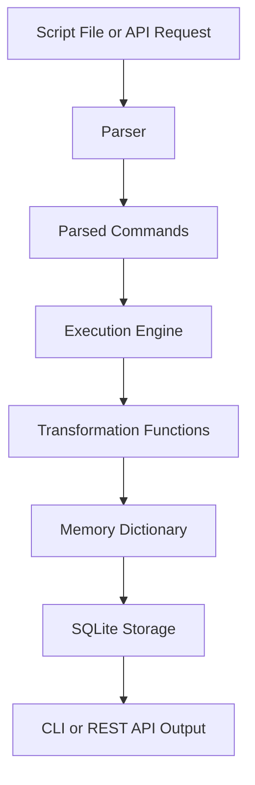

# AlphaLabLite

AlphaLabLite is a lightweight Python project that executes a small domain-specific language (DSL) for time-series transformations. It reads a simple script, parses each command, runs financial-style transformations such as moving averages and crossover signals, stores results in memory, persists outputs to SQLite, and exposes the workflow through both a command-line interface and a FastAPI REST API.

## Motivation

Many data workflows repeat the same pattern: fetch a series, transform it, generate signals, simulate a result, and save the output. AlphaLabLite solves this in a compact, beginner-friendly way by allowing a user to describe the workflow as a script instead of calling every Python function manually.

The project is intentionally small. Its value is in showing how parsing, execution, transformation logic, persistence, a CLI, and an API can work together in one clean pipeline.

## Walkthrough Notebook

For a step-by-step project explanation and demo, see the [AlphaLabLite Walkthrough Notebook](./AlphaLabLite_Walkthrough.ipynb).

## Core Features

- Custom DSL syntax for defining transformation pipelines
- Parser that converts script lines into structured command dictionaries
- Execution engine that maps DSL function names to Python functions
- Time-series transformations using `numpy` and `pandas`
- In-memory variable storage during script execution
- SQLite persistence for saved script outputs
- CLI commands for executing scripts and viewing saved results
- FastAPI endpoints for running scripts and retrieving variables

## DSL Scripting Idea

AlphaLabLite scripts use this format:

```text
variable = Function{configs}{inputs}
```

- `variable`: name where the result will be stored in memory
- `Function`: transformation function to run
- `configs`: constants or settings, such as a moving average window
- `inputs`: previously created variables used as function inputs

Example:

```text
price = Fetch{OneMinuteGoldPrices}{}
fast = ExponentialMovingAverage{0.3}{price}
slow = SimpleMovingAverage{20}{price}
entry = CrossAbove{}{fast, slow}
exit = CrossAbove{}{slow, fast}
result = PortfolioSimulation{10000}{entry, exit, price}
```

## System Architecture



## Project Workflow

```text
Script
  ↓
Parser
  ↓
Engine
  ↓
Transformations
  ↓
Memory
  ↓
SQLite
  ↓
CLI/API
  ↓
Output
```

## Folder Structure

```text
AlphaLabLite/
├── app.py
├── engine.py
├── main.py
├── parsing.py
├── storage.py
├── transformations.py
├── script.txt
├── requirements.txt
├── alpha_lab_lite.db
└── data/
    └── fetch_transformation_data.csv
```

Note: the implementation expects the CSV data file at `data/fetch_transformation_data.csv` relative to the directory where the program is run.

## File Guide

### `transformations.py`

Contains the actual transformation functions used by the engine:

- `Fetch`
- `simpleMovingAverage`
- `ExponentialMovingAverage`
- `RateOfChange`
- `CrossAbove`
- `ConstantSeries`
- `PortfolioSimulation`

This file is the calculation layer of the project.

### `parsing.py`

Converts DSL text into structured Python dictionaries. It validates the command format and separates each line into:

- variable name
- function name
- configuration values
- input variables

### `engine.py`

Runs parsed commands. It maps DSL function names to Python functions, converts config values into numbers when possible, resolves input variables from memory, executes the selected function, and stores the result.

### `storage.py`

Handles SQLite persistence. It creates the database table if needed, saves all variables produced by a script under a unique `script_id`, and loads selected variables later.

### `main.py`

Provides the command-line interface. It supports:

- `execute`: run a script from stdin or from a script file and save its outputs
- `view`: retrieve saved variables by script ID

### `app.py`

Provides the FastAPI REST API. It supports:

- `POST /execute`: execute a script and return a `script_id`
- `GET /view/{script_id}`: retrieve saved variables using repeated `items` query parameters
- `GET /view`: retrieve saved variables using `script_id` and comma-separated `variables`

## Setup Instructions

### 1. Create a virtual environment

```bash
python -m venv venv
```

### 2. Activate the virtual environment

Windows PowerShell:

```bash
.\venv\Scripts\Activate.ps1
```

Windows Command Prompt:

```bash
venv\Scripts\activate
```

macOS/Linux:

```bash
source venv/bin/activate
```

### 3. Install dependencies

```bash
pip install -r requirements.txt
```

If a requirements file is unavailable or incomplete, install the runtime dependencies directly:

```bash
pip install numpy pandas fastapi pydantic uvicorn
```

## Run the CLI

Execute a script:

```bash
python main.py execute script.txt
```

Or paste the script directly, as shown in the PDF examples:

```bash
python main.py execute
```

Then paste the script and press end-of-file when finished.

The command prints a generated `script_id`.

View saved variables:

```bash
python main.py view --id YOUR_SCRIPT_ID price result
```

Example:

```bash
python main.py view --id 7e6c4a0e-1111-2222-3333-123456789abc price result
```

## Run the API

Start the FastAPI server:

```bash
uvicorn app:app --reload
```

Open the interactive API docs:

```text
http://127.0.0.1:8000/docs
```

### Execute Script Request

```bash
curl -X POST "http://127.0.0.1:8000/execute" \
  -H "Content-Type: application/json" \
  -d "{\"script\":\"price = Fetch{OneMinuteGoldPrices}{}\"}"
```

Response:

```json
{
  "message": "Script successfully executed",
  "script_id": "generated-script-id",
  "result": "generated-script-id"
}
```

### View Result Request

PDF-compatible route:

```bash
curl "http://127.0.0.1:8000/view/YOUR_SCRIPT_ID?items=price&items=result"
```

Alternative route:

```bash
curl "http://127.0.0.1:8000/view?script_id=YOUR_SCRIPT_ID&variables=price,result"
```

Response:

```json
{
  "price": [100, 101, 103.0],
  "result": [10000, 10000, 10000]
}
```

Actual values depend on the script and source data.

## SQLite Persistence

AlphaLabLite stores execution outputs in `alpha_lab_lite.db`.

Each script run receives a unique UUID called `script_id`. Every variable in memory is saved as one row:

- `script_id`: groups variables from the same script run
- `variable_name`: name of the DSL variable
- `variable_json`: JSON representation of the variable value

This design keeps persistence simple and makes it easy to retrieve selected variables later through the CLI or API.

## Testing

This project can be tested at three levels:

1. Parser tests: verify that DSL commands are parsed correctly.
2. Transformation tests: verify moving averages, rate of change, crossover signals, and portfolio simulation outputs.
3. End-to-end tests: execute a full script and confirm expected variables are saved and can be loaded.

Manual smoke test:

```bash
python main.py execute script.txt
python main.py view --id YOUR_SCRIPT_ID price result
```

API smoke test:

```bash
uvicorn app:app --reload
```

Then use `http://127.0.0.1:8000/docs` to run `/execute` and `/view`.

The PDF-style API view route is:

```text
/view/{script_id}?items=price&items=result
```

## Common Errors and Troubleshooting

### `ModuleNotFoundError`

The virtual environment may not be activated, or dependencies may not be installed.

Fix:

```bash
pip install numpy pandas fastapi pydantic uvicorn
```

### `FileNotFoundError: data/fetch_transformation_data.csv`

`Fetch` reads from `data/fetch_transformation_data.csv` using a relative path. Run commands from the project root so the `data` folder is visible.

### `Unknown function`

The script used a function name that is not registered in `engine.py`.

Check the spelling and supported function names:

- `Fetch`
- `SimpleMovingAverage`
- `ExponentialMovingAverage`
- `RateOfChange`
- `CrossAbove`
- `ConstantSeries`
- `PortfolioSimulation`

### `Variable was used before being created`

The script referenced an input variable before assigning it.

Make sure each variable is created earlier in the script.

### Empty result from `/view`

Confirm that:

- the `script_id` is correct
- the variable names are spelled correctly
- the database file was not deleted or recreated

## Future Improvements

- Add automated unit tests for parser, engine, transformations, and storage
- Add comments or whitespace support in the DSL
- Improve validation for function argument counts
- Add richer API error responses
- Add support for additional data sources
- Add optional plotting for time-series outputs
- Add a small frontend for running scripts and viewing results

## One-Minute Interview Explanation

AlphaLabLite is a small Python DSL engine for time-series workflows. A user writes a script using the format `variable = Function{configs}{inputs}`. The parser turns each line into structured commands, the engine resolves dependencies from memory, runs transformation functions such as moving averages and crossover signals, and saves the generated variables into SQLite. I exposed the same execution flow through both a command-line interface and a FastAPI API. The project demonstrates parsing, function dispatch, state management, persistence, and API design in a compact and easy-to-explain system.
